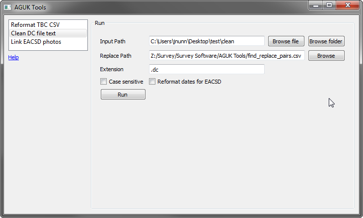
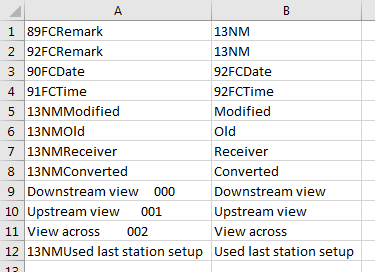

[Home](readme.md)

# Clean DC File Text

Performs multiple text replacements in multiple files with pairs of text items defined in a csv file.

Trimble DC files require some cleaning before import into N4ce which causes time, date, survey method and other attributes to be correctly identified. This tool takes a CSV containing rows with \<find_text>,\<replace_text> pairs and finds all instances of `find_text` in all files in a folder and replaces them with `replace_text`. Additionally, dates can be detected and converted to EACSD format for cross section processing.

Simply browse to the folder containing the dc files to be cleaned, provide the find and replace file to perform the clean.

The find and replace CSV should contain one or more rows with the `find` text in the left column and the `replace` text in the right column.

A folder `clean` will be created containing the cleaned dc files.
