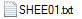
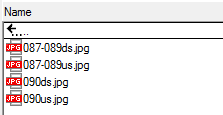
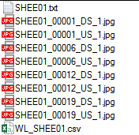
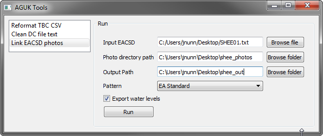
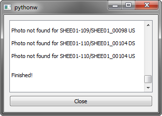

[Home](readme.md)

# Link EACSD Photos

Links an EACSD file with photos and renames them. Optionally writes
a file with formatted water level text.

 + 
 = 

Photos and cross sections must be named with one of the following patterns in order to link them:

- Section number with us/ds/va suffix, e.g. 001us, 045ds
- Section number with us/ds/va suffix plus enumerator, e.g. 001ds1, 0045ds2
- Any of the above two patterns, but including a single letter suffix to the section id, e.g. 001ads
- Range of section numbers with single us/ds/va suffix, e.g. 010-015ds
- Range of section numbers with single us/ds/va suffix plus enumerator, e.g. 010-015ds1

_IMPORTANT_ Photos named with a suffix will be linked to photo points in the order they are
found in the EACSD. The order they are written in the EACSD is based on the order
N4ce finds them in the cross section models, not based on the string number.
Care must be taken to make sure the photos are in the right order to use this
functionality - you can sort the photos in the N4ce model.

_IMPORTANT_ The tool will not identify if there are any photos missing from sections if there aren't any photos points - that must be checked manually beforehand when processing sections and gathering photos.

Photos which do not match any of the above patterns will be ignored. If a range
is supplied, any section numbers missing from that range in the EACSD will be
ignored.

The output directory will contain copies of the photos renamed with a certain pattern.
At the moment, only 2 known patterns are accommodated:

- EA - \<REACH>\<REACHID>_\<CHAINAGE>_\<DIRECTION>_\<ENUMERATOR>  e.g. WOOL01_00123_US_1
- EANE - \<REACH>\<REACHID>_P_\<CHAINAGE>_\<YYYMM>_\<DIRECTION>_\<ENUMERATOR>  e.g. WOOL01_P_00123_201612_US_1

If the water level file is requested, a CSV will be exported containing text
formatted for presentation, e.g. WL=21.61m at 16:18 on 15/02/2017

If there are any photo points without a matching photo, they will be shown in the results message box.

The outputs will appear in the output directory, where the photos are renamed, a new EACSD file with photo filenames included, and a water level CSV to use when drawing up sections in CAD.

