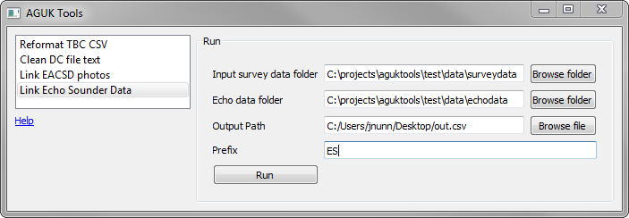
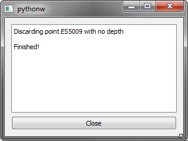

[Home](readme.md)

# Link Echo Sounder Data

Finds multiple survey data CSV files and echo sounder data CSV files in the input folders, links and reduces heights for points found in both files. If a prefix is supplied, point id's with this prefix will be considered as echo sounder points to allow automatic filtering of points without depths. If omitted, or if the points do not have the prefix, no filtering will occur.

The inputs are directories containing one or more csv files. The echo sounder input directory must only contain CSVs of echo sounder data. The survey data directory must only contain survey data as exported from N4ce, including any dimensions and remarks. The output is a single CSV containing all rows from the survey data files with any heights reduced by the depth found for the same point in the echo sounder files. If a prefix is provided, any points found in the survey data which have an associated point but no height in the echo sounder data will be removed as these represent unreduced heights from the echo sounder which are unusable. If the prefix is not provided or for any points are found without the prefix, this behaviour is ignored.

Any information concerning discarded or missing points is reported.

