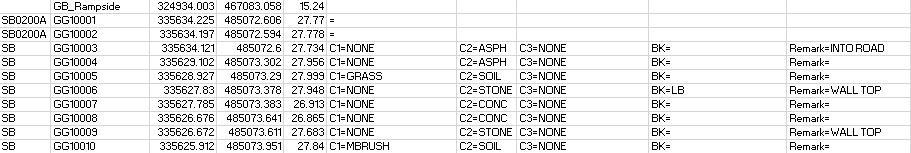
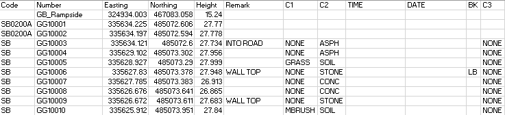
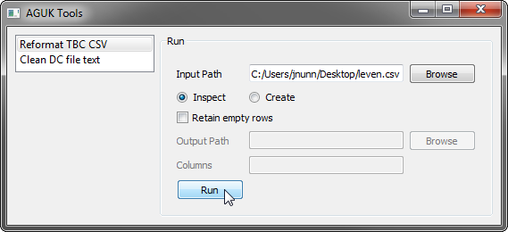
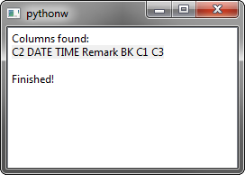

[Home](readme.md)

# Reformat TBC CSV

When exporting detail observations from Trimble Business Center, attributes are included in an unpredictable order and each cell contains the attribute name and value. This tool searches through the CSV and creates columns and cleans the values from the attributes, tells you which ones exist and lets you optionally reorder the columns when exporting. This allows you to create a CSV which is readable  by N4ce so long as the CSV import format is edited.

Before:

After:

## Usage
1. Select 'Reformat TBC CSV'.
1. Click 'Browse' and navigate to the CSV file exported from TBC.
1. Leave 'Inspect' checked to allow you to discover which attributes are in the file before creating the final CSV.
1. 'Retain empty rows' should generally be left unchecked - this is only to allow you to keep any junky rows which contain no coordinates.
1. Click 'Run' to show a report on the attributes in the file:

6. A dialog will appear showing the columns which have been found:

7. You may either leave the 'Columns' box alone and accept the order of the columns found, or you can reorder the columns manually by typing them out in the order you want in the columns box, each separated by a space: e.g. C1 C2 C3 BK TIME DATE Remark.
1. Make sure the 'Create' checkbox is checked.
1. Click 'Browse' and select an output file path.
1. Click 'Run' to create the reformatted CSV:

